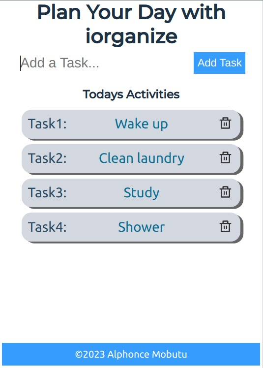

## Preview

# iOrganize

> An app that help people organise their daily activities

## Built With

- React
- LocalStorage
- Redux
- JavaScript

## Live Demo
[Live Demo](https://fancy-cassata-395be5.netlify.app)

## Getting Started

    git clone https://github.com/tingamapuro04/todo-react.git
    cd todo-react
    npm install
    npm start
    

To get a local copy up and running follow these simple example steps.

### Prerequisites
You need to install node js

## Authors

👤 **Alphonce Mobutu**

- GitHub: [@tingamapuro04](https://github.com/tingamapuro04)
- LinkedIn: [@adoyo-alphonce](https://www.linkedin.com/in/adoyo-alphonce/)

## 🤝 Contributing

Contributions, issues, and feature requests are welcome!

Feel free to check the [issues page](https://github.com/tingamapuro04/todo-react/issues/2).

## Show your support

Give a ⭐️ if you like this project!

## 📝 License

This project is [MIT](./MIT.md) licensed.